[TOC]

---

## Overview

This document describes all API endpoints for the **Bookings** module, including seat holding, booking confirmation, payment gateway integration (VNPay & MoMo), payment status checking, and seat releasing.

---

## 1. Get Account Booked Tickets

| API        | URL                            |
| ---------- | ------------------------------ |
| GET        | /me/tickets/                   |
| Permission | IsAuthenticated (JWT required) |

## Request sample

```
GET /me/tickets/
Authorization: Bearer <access_token>
```

No request body or query parameters required.

## Response sample

```json
[
  {
    "bookingId": "BK-A1B2C3D4E5",
    "movieTitle": "Avengers: Endgame",
    "start_time": "2025-07-01 18:00",
    "end_time": "2025-07-01 20:30",
    "purchase_time": "2025-06-30 10:00",
    "hall": "Room 1",
    "seats": ["A1", "A2"],
    "totalAmount": 240000,
    "finalAmount": 200000,
    "discountAmount": 40000,
    "status": "confirmed"
  }
]
```

## Validation

<table>
<th>Status code</th>
<th>Description</th>
<th>Examples</th>
<tbody>
<tr>
<td>200</td>
<td>Returns all bookings for the authenticated user</td>
<td>

```json
[{ "bookingId": "BK-...", "movieTitle": "...", "seats": ["A1"] }]
```

</td>
</tr>
<tr>
<td>401</td>
<td>User not authenticated</td>
<td>

```json
{ "detail": "Authentication credentials were not provided." }
```

</td>
</tr>
</tbody>
</table>

## Activity Diagram

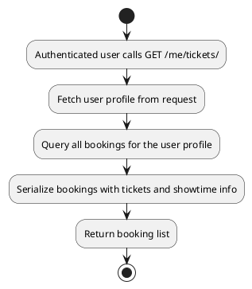

## Sequence Diagram

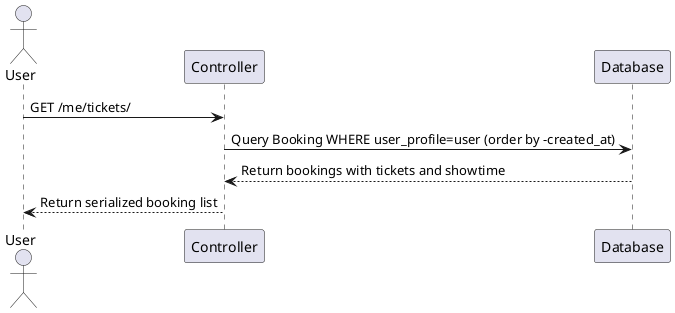

---

## 2. Confirm Booking

| API        | URL                            |
| ---------- | ------------------------------ |
| POST       | /bookings/confirm/             |
| Permission | IsAuthenticated (JWT required) |

## Request sample

```json
{
  "showtime_id": 10,
  "seat_labels": ["A1", "A2"],
  "promo_code": "MOVIE50",
  "movie_id": 3,
  "flat_price_promotion_id": 2,
  "points_to_redeem": 100,
  "concession_amount": 50000,
  "concessions": [{ "id": 5, "quantity": 2 }],
  "payment_method": "vnpay"
}
```

| Field                   | Description                              | Data Type       | Examples                       |
| ----------------------- | ---------------------------------------- | --------------- | ------------------------------ |
| showtime_id             | ID of the showtime to book               | integer         | `10`                           |
| seat_labels             | List of seat labels to book              | array of string | `["A1", "A2"]`                 |
| promo_code              | (Optional) Movie promotion code          | string          | `"MOVIE50"`                    |
| movie_id                | (Optional) Movie ID for promo validation | integer         | `3`                            |
| flat_price_promotion_id | (Optional) Flat price promotion ID       | integer         | `2`                            |
| points_to_redeem        | (Optional) Loyalty points to redeem      | integer         | `100`                          |
| concession_amount       | (Optional) Total concession amount       | decimal         | `50000`                        |
| concessions             | (Optional) List of concession items      | array of object | `[{ "id": 5, "quantity": 2 }]` |
| payment_method          | Payment gateway to use                   | string          | `"vnpay"`, `"momo"`            |

## Response sample

```json
{
  "bookingId": "BK-A1B2C3D4E5",
  "movieTitle": "Avengers: Endgame",
  "start_time": "2025-07-01 18:00",
  "end_time": "2025-07-01 20:30",
  "purchase_time": "2025-07-01 09:00",
  "hall": "Room 1",
  "seats": ["A1", "A2"],
  "totalAmount": 240000,
  "finalAmount": 190000,
  "discountAmount": 50000,
  "pointsUsed": 100,
  "pointsEarned": 0,
  "paymentUrl": "https://sandbox.vnpayment.vn/paymentv2/vpcpay.html?...",
  "paymentMethod": "vnpay",
  "txnRef": "PAY-ABCDEF123456"
}
```

## Validation

<table>
<th>Status code</th>
<th>Description</th>
<th>Examples</th>
<tbody>
<tr>
<td>201</td>
<td>Booking created and payment URL generated</td>
<td>

```json
{ "bookingId": "BK-...", "paymentUrl": "https://...", "txnRef": "PAY-..." }
```

</td>
</tr>
<tr>
<td>400</td>
<td>Showtime has already started</td>
<td>

```json
{ "detail": "Cannot confirm booking for a showtime that has already started." }
```

</td>
</tr>
<tr>
<td>400</td>
<td>Invalid promo code</td>
<td>

```json
{ "detail": "Promo code not found." }
```

</td>
</tr>
<tr>
<td>400</td>
<td>Promo expired or not valid for movie</td>
<td>

```json
{ "detail": "Promo code is expired or not valid for this movie." }
```

</td>
</tr>
<tr>
<td>400</td>
<td>Point redemption not available</td>
<td>

```json
{ "detail": "Point redemption is not available." }
```

</td>
</tr>
<tr>
<td>400</td>
<td>Redeeming more points than allowed</td>
<td>

```json
{ "detail": "Cannot redeem 500 pts. Max: 200 pts." }
```

</td>
</tr>
<tr>
<td>404</td>
<td>Showtime not found or not confirmed</td>
<td>

```json
{ "detail": "Showtime not found or not confirmed." }
```

</td>
</tr>
<tr>
<td>409</td>
<td>Seat holds expired or missing</td>
<td>

```json
{
  "detail": "Seat holds expired or missing: A1, A2. Please select seats again."
}
```

</td>
</tr>
<tr>
<td>409</td>
<td>Seats already booked</td>
<td>

```json
{ "detail": "Seats already booked: A1" }
```

</td>
</tr>
<tr>
<td>502</td>
<td>Failed to create payment URL</td>
<td>

```json
{ "detail": "Failed to create payment URL. Please try again." }
```

</td>
</tr>
</tbody>
</table>

## Activity Diagram

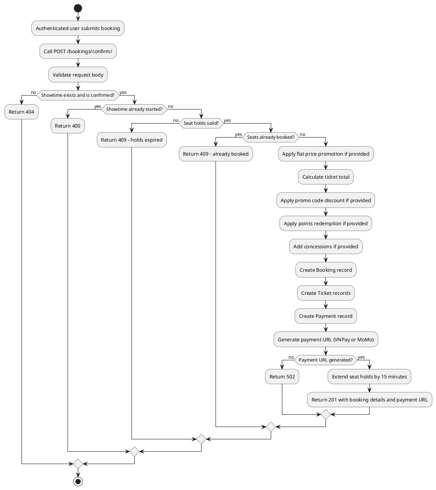

## Sequence Diagram

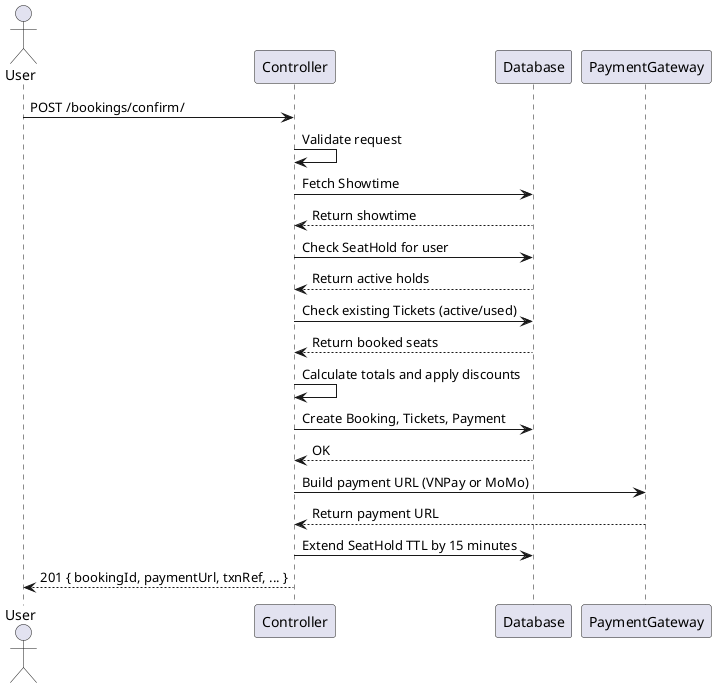

---

## 3. Check Payment Status

| API        | URL                                 |
| ---------- | ----------------------------------- |
| GET        | /bookings/payment-status/<txn_ref>/ |
| Permission | IsAuthenticated (JWT required)      |

## Request sample

```
GET /bookings/payment-status/PAY-ABCDEF123456/
Authorization: Bearer <access_token>
```

| Field   | Description                        | Data Type | Examples             |
| ------- | ---------------------------------- | --------- | -------------------- |
| txn_ref | Transaction reference (path param) | string    | `"PAY-ABCDEF123456"` |

## Response sample

```json
{
  "txnRef": "PAY-ABCDEF123456",
  "status": "success",
  "gateway": "vnpay",
  "amount": 190000,
  "bookingCode": "BK-A1B2C3D4E5",
  "bookingStatus": "confirmed"
}
```

## Validation

<table>
<th>Status code</th>
<th>Description</th>
<th>Examples</th>
<tbody>
<tr>
<td>200</td>
<td>Returns payment and booking status</td>
<td>

```json
{ "txnRef": "PAY-...", "status": "success", "bookingStatus": "confirmed" }
```

</td>
</tr>
<tr>
<td>404</td>
<td>Payment not found</td>
<td>

```json
{ "detail": "Payment not found." }
```

</td>
</tr>
</tbody>
</table>

## Activity Diagram

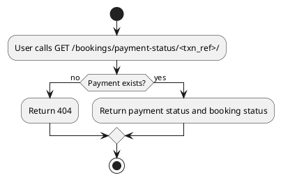

## Sequence Diagram

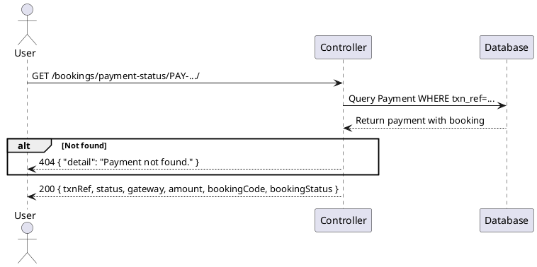

---

## 4. VNPay Return

| API        | URL                     |
| ---------- | ----------------------- |
| GET        | /bookings/vnpay-return/ |
| Permission | AllowAny                |

## Request sample

```
GET /bookings/vnpay-return/?vnp_TxnRef=PAY-ABCDEF&vnp_ResponseCode=00&vnp_SecureHash=...
```

| Field             | Description                      | Data Type | Examples                          |
| ----------------- | -------------------------------- | --------- | --------------------------------- |
| vnp_TxnRef        | Transaction reference from VNPay | string    | `"PAY-ABCDEF"`                    |
| vnp_ResponseCode  | VNPay response code              | string    | `"00"` (success), `"99"` (failed) |
| vnp_SecureHash    | HMAC-SHA512 signature from VNPay | string    | `"abc123..."`                     |
| vnp_TransactionNo | VNPay's own transaction ID       | string    | `"12345678"`                      |

## Response sample

```
HTTP 302 Redirect
Location: https://frontend.com/booking?payment_callback=vnpay&txn_ref=PAY-ABCDEF
```

## Validation

<table>
<th>Status code</th>
<th>Description</th>
<th>Examples</th>
<tbody>
<tr>
<td>302</td>
<td>Payment success - booking confirmed, tickets activated, redirect to frontend</td>
<td>

```
Redirect -> /booking?payment_callback=vnpay&txn_ref=PAY-...
```

</td>
</tr>
<tr>
<td>302</td>
<td>Payment failed - booking cancelled, tickets deleted, redirect to frontend</td>
<td>

```
Redirect -> /booking?payment_callback=vnpay&txn_ref=PAY-...
```

</td>
</tr>
</tbody>
</table>

## Activity Diagram

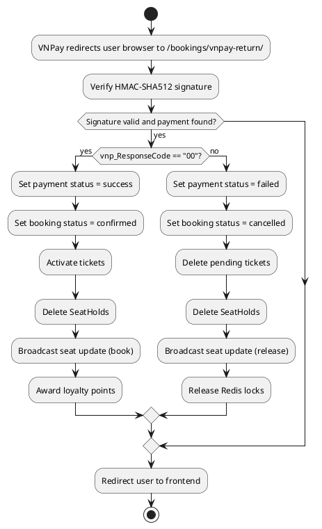

## Sequence Diagram

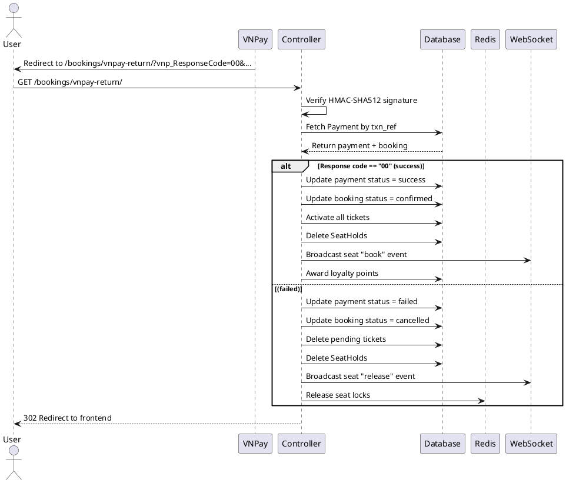

---

## 5. MoMo IPN (Instant Payment Notification)

| API        | URL                 |
| ---------- | ------------------- |
| POST       | /bookings/momo-ipn/ |
| Permission | AllowAny            |

## Request sample

```json
{
  "orderId": "PAY-ABCDEF123456",
  "resultCode": 0,
  "transId": "987654321",
  "amount": "190000",
  "extraData": "",
  "message": "Success",
  "orderInfo": "CineBook booking BK-A1B2C3D4E5",
  "orderType": "momo_wallet",
  "partnerCode": "MOMOXXXX",
  "payType": "qr",
  "requestId": "uuid-xxxx",
  "responseTime": "1719820800000",
  "signature": "abc123..."
}
```

| Field      | Description                     | Data Type | Examples                         |
| ---------- | ------------------------------- | --------- | -------------------------------- |
| orderId    | Transaction reference           | string    | `"PAY-ABCDEF123456"`             |
| resultCode | MoMo result code                | integer   | `0` (success), non-zero (failed) |
| transId    | MoMo's own transaction ID       | string    | `"987654321"`                    |
| signature  | HMAC-SHA256 signature from MoMo | string    | `"abc123..."`                    |

## Response sample

```json
{
  "resultCode": 0,
  "message": "OK"
}
```

## Validation

<table>
<th>Status code</th>
<th>Description</th>
<th>Examples</th>
<tbody>
<tr>
<td>200</td>
<td>IPN processed successfully (payment success)</td>
<td>

```json
{ "resultCode": 0, "message": "OK" }
```

</td>
</tr>
<tr>
<td>200</td>
<td>Invalid signature</td>
<td>

```json
{ "resultCode": 1, "message": "Invalid signature" }
```

</td>
</tr>
<tr>
<td>200</td>
<td>Order not found</td>
<td>

```json
{ "resultCode": 1, "message": "Order not found" }
```

</td>
</tr>
</tbody>
</table>

## Activity Diagram

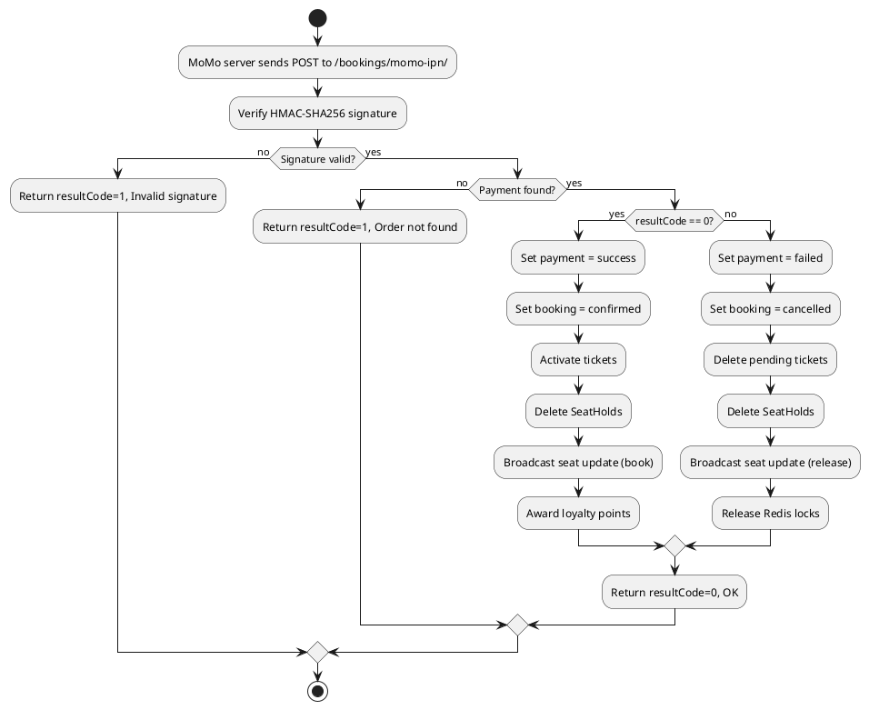

## Sequence Diagram

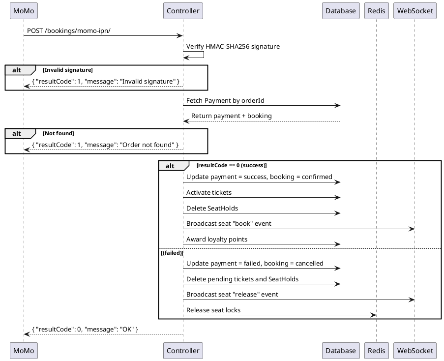

---

## 6. MoMo Return (Browser Redirect)

| API        | URL                    |
| ---------- | ---------------------- |
| GET        | /bookings/momo-return/ |
| Permission | AllowAny               |

## Request sample

```
GET /bookings/momo-return/?orderId=PAY-ABCDEF123456&resultCode=0
```

| Field      | Description                     | Data Type | Examples                        |
| ---------- | ------------------------------- | --------- | ------------------------------- |
| orderId    | Transaction reference from MoMo | string    | `"PAY-ABCDEF123456"`            |
| resultCode | MoMo result code                | string    | `"0"` (success), other (failed) |

## Response sample

```
HTTP 302 Redirect
Location: https://frontend.com/booking?payment_callback=momo&txn_ref=PAY-ABCDEF123456
```

## Validation

<table>
<th>Status code</th>
<th>Description</th>
<th>Examples</th>
<tbody>
<tr>
<td>302</td>
<td>Payment success - booking confirmed, tickets activated, redirect to frontend</td>
<td>

```
Redirect -> /booking?payment_callback=momo&txn_ref=PAY-...
```

</td>
</tr>
<tr>
<td>302</td>
<td>Payment failed - booking cancelled, tickets deleted, redirect to frontend</td>
<td>

```
Redirect -> /booking?payment_callback=momo&txn_ref=PAY-...
```

</td>
</tr>
</tbody>
</table>

## Activity Diagram

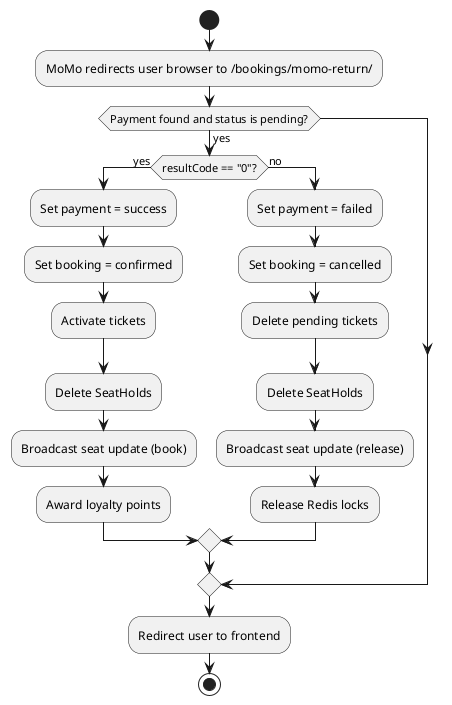

## Sequence Diagram

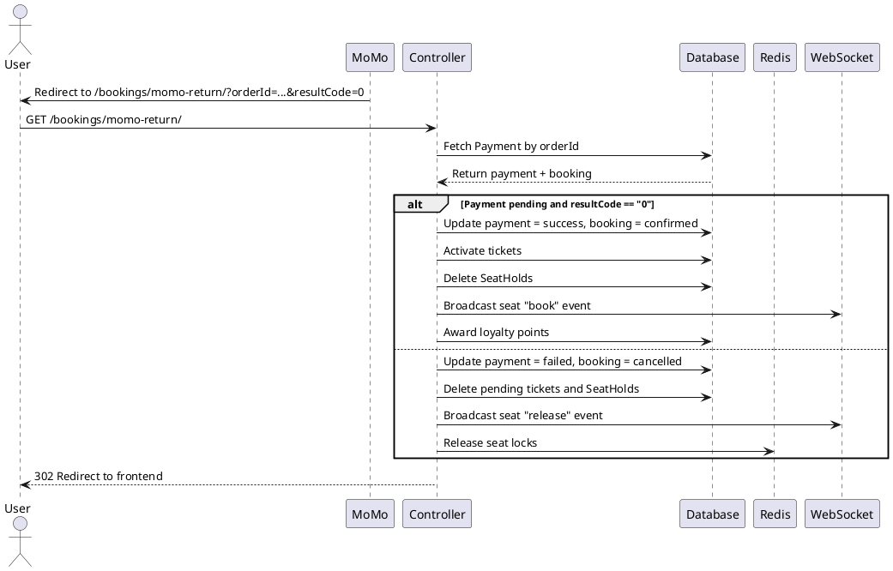

---

## 7. Hold Seats

| API        | URL                            |
| ---------- | ------------------------------ |
| POST       | /bookings/hold/                |
| Permission | IsAuthenticated (JWT required) |

## Request sample

```json
{
  "showtime_id": 10,
  "seat_labels": ["A1", "A2"]
}
```

| Field       | Description                 | Data Type       | Examples       |
| ----------- | --------------------------- | --------------- | -------------- |
| showtime_id | ID of the showtime          | integer         | `10`           |
| seat_labels | List of seat labels to hold | array of string | `["A1", "A2"]` |

## Response sample

```json
{
  "held": ["A1", "A2"],
  "showtime_id": 10,
  "expires_at": "2025-07-01T18:05:00+07:00",
  "hold_seconds": 300
}
```

## Validation

<table>
<th>Status code</th>
<th>Description</th>
<th>Examples</th>
<tbody>
<tr>
<td>200</td>
<td>Seats held successfully</td>
<td>

```json
{
  "held": ["A1", "A2"],
  "showtime_id": 10,
  "expires_at": "...",
  "hold_seconds": 300
}
```

</td>
</tr>
<tr>
<td>400</td>
<td>showtime_id is missing</td>
<td>

```json
{ "detail": "'showtime_id' is required." }
```

</td>
</tr>
<tr>
<td>400</td>
<td>Invalid seat labels</td>
<td>

```json
{ "detail": "Invalid seat labels: X9, Z99" }
```

</td>
</tr>
<tr>
<td>400</td>
<td>Showtime has already started</td>
<td>

```json
{ "detail": "Cannot book seats for a showtime that has already started." }
```

</td>
</tr>
<tr>
<td>404</td>
<td>Showtime not found or not confirmed</td>
<td>

```json
{ "detail": "Showtime not found or not confirmed." }
```

</td>
</tr>
<tr>
<td>408</td>
<td>Booking session window expired</td>
<td>

```json
{
  "detail": "Your 15-minute booking window has expired. Please start a new seat selection."
}
```

</td>
</tr>
<tr>
<td>409</td>
<td>Seats already sold</td>
<td>

```json
{ "detail": "Seats already sold: A1" }
```

</td>
</tr>
<tr>
<td>409</td>
<td>One or more seats held by another user</td>
<td>

```json
{
  "detail": "One or more selected seats are no longer available.",
  "conflicting_seats": ["A1"]
}
```

</td>
</tr>
<tr>
<td>500</td>
<td>Failed to persist seat hold</td>
<td>

```json
{ "detail": "Failed to persist seat hold. Please try again." }
```

</td>
</tr>
</tbody>
</table>

## Activity Diagram

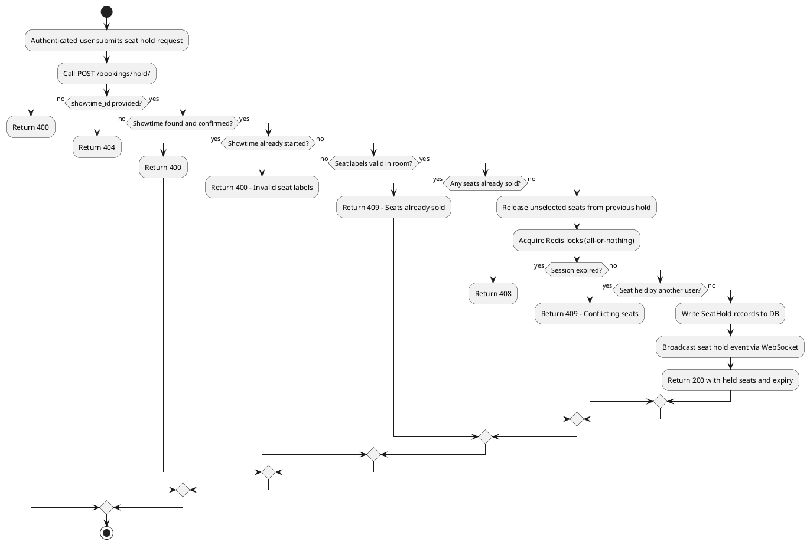

## Sequence Diagram

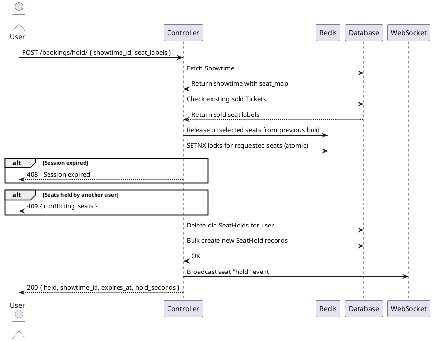

---

## 8. Release Seats

| API        | URL                            |
| ---------- | ------------------------------ |
| POST       | /bookings/release/             |
| Permission | IsAuthenticated (JWT required) |

## Request sample

```json
{
  "showtime_id": 10,
  "seat_labels": ["A1", "A2"]
}
```

| Field       | Description                                                | Data Type       | Examples       |
| ----------- | ---------------------------------------------------------- | --------------- | -------------- |
| showtime_id | ID of the showtime                                         | integer         | `10`           |
| seat_labels | (Optional) Specific seats to release. Omit to release all. | array of string | `["A1", "A2"]` |

## Response sample

```json
{
  "released_redis": 2,
  "released_db": 2
}
```

## Validation

<table>
<th>Status code</th>
<th>Description</th>
<th>Examples</th>
<tbody>
<tr>
<td>200</td>
<td>Seats released successfully from Redis and DB</td>
<td>

```json
{ "released_redis": 2, "released_db": 2 }
```

</td>
</tr>
<tr>
<td>400</td>
<td>showtime_id is missing</td>
<td>

```json
{ "detail": "'showtime_id' is required." }
```

</td>
</tr>
</tbody>
</table>

## Activity Diagram

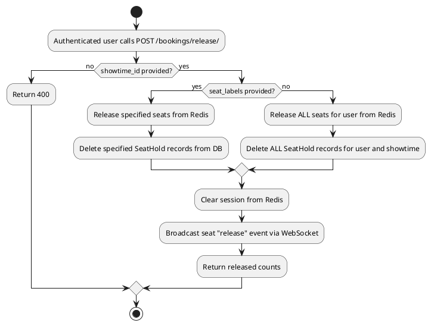

## Sequence Diagram

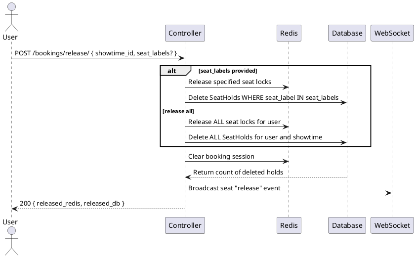
