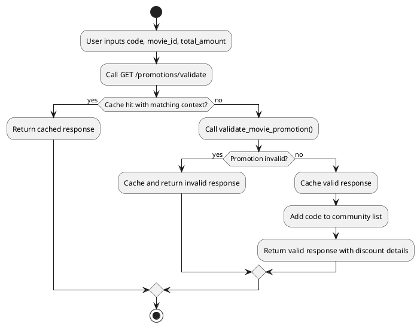
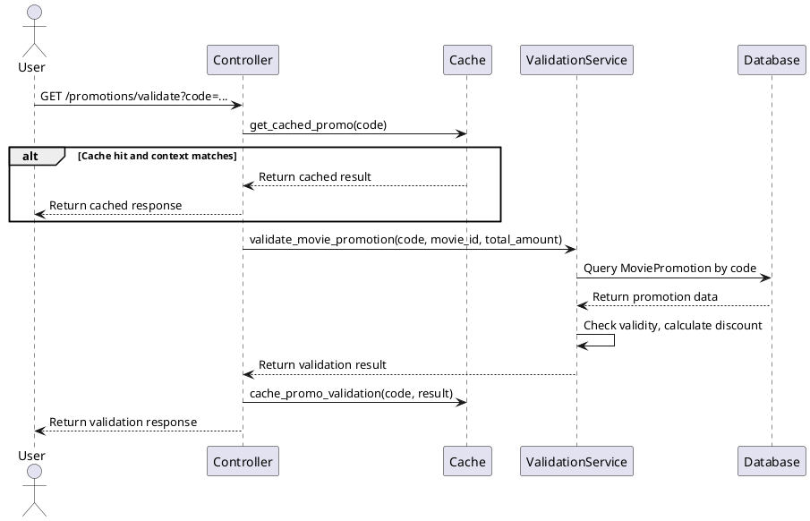
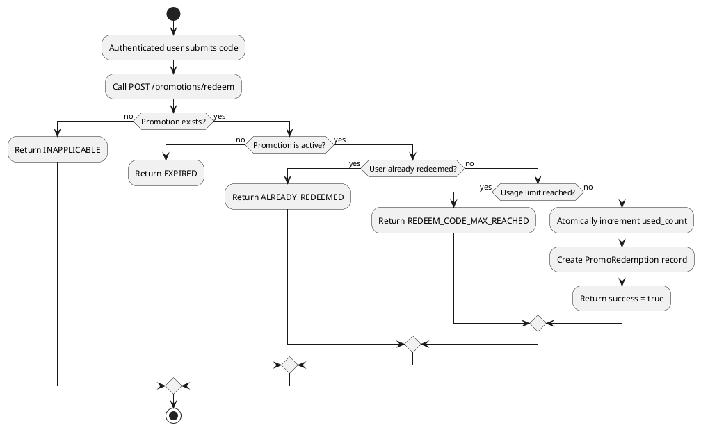
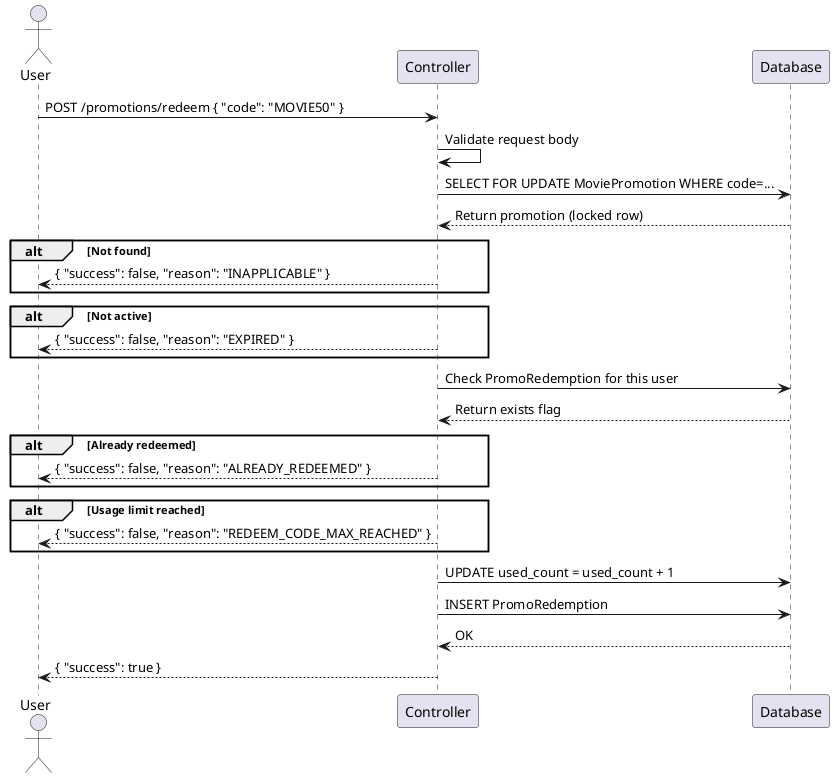

[TOC]

---

## Overview

This document describes all API endpoints for the **Promotions** module, including validation, redemption, listing, and community discovery features.

---

## 1. Validate Movie Promotion

| API        | URL                  |
| ---------- | -------------------- |
| GET        | /promotions/validate |
| Permission | N/A                  |

## Request sample

```json
GET /promotions/validate?code=MOVIE50&movie_id=3&total_amount=150000
```

| Field        | Description                            | Data Type | Examples  |
| ------------ | -------------------------------------- | --------- | --------- |
| code         | The promotion code to validate         | string    | `MOVIE50` |
| movie_id     | The movie ID of the current booking    | integer   | `3`       |
| total_amount | Current subtotal (seats + concessions) | decimal   | `150000`  |

## Response sample (Valid)

```json
{
  "valid": true,
  "reason": null,
  "promotion": {
    "id": 1,
    "code": "MOVIE50",
    "discount_type": "PERCENTAGE",
    "discount_value": "0.50"
  },
  "calculated_discount": {
    "original_amount": "150000",
    "discount_amount": "75000",
    "final_amount": "75000"
  },
  "movie_id": 3,
  "total_amount": "150000"
}
```

## Response sample (Invalid)

```json
{
  "valid": false,
  "reason": "EXPIRED",
  "movie_id": 3,
  "total_amount": "150000"
}
```

## Validation

<table>
<th>Status code</th>
<th>Description</th>
<th>Examples</th>
<tbody>
<tr>
<td>200</td>
<td>Promotion is valid</td>
<td>

```json
{ "valid": true, "reason": null, "promotion": {}, "calculated_discount": {} }
```

</td>
</tr>
<tr>
<td>200</td>
<td>Promotion is invalid</td>
<td>

```json
{ "valid": false, "reason": "EXPIRED" }
```

</td>
</tr>
<tr>
<td>200</td>
<td>Promo not valid for selected movie</td>
<td>

```json
{
  "valid": false,
  "reason": "...",
  "error": "This promo code is not valid for the selected movie."
}
```

</td>
</tr>
<tr>
<td>400</td>
<td>Validation error on query params</td>
<td>

```json
{ "detail": "code is required." }
```

</td>
</tr>
</tbody>
</table>

## Activity Diagram



## Sequence Diagram



---

## 2. Redeem Promotion

| API        | URL                            |
| ---------- | ------------------------------ |
| POST       | /promotions/redeem             |
| Permission | IsAuthenticated (JWT required) |

## Request sample

```json
{
  "code": "MOVIE50"
}
```

| Field | Description                  | Data Type | Examples  |
| ----- | ---------------------------- | --------- | --------- |
| code  | The promotion code to redeem | string    | `MOVIE50` |

## Response sample

```json
{
  "success": true
}
```

## Validation

<table>
<th>Status code</th>
<th>Description</th>
<th>Examples</th>
<tbody>
<tr>
<td>200</td>
<td>Redemption successful</td>
<td>

```json
{ "success": true }
```

</td>
</tr>
<tr>
<td>200</td>
<td>Promotion not found</td>
<td>

```json
{ "success": false, "reason": "INAPPLICABLE" }
```

</td>
</tr>
<tr>
<td>200</td>
<td>Promotion expired or inactive</td>
<td>

```json
{ "success": false, "reason": "EXPIRED" }
```

</td>
</tr>
<tr>
<td>200</td>
<td>User already redeemed</td>
<td>

```json
{ "success": false, "reason": "ALREADY_REDEEMED" }
```

</td>
</tr>
<tr>
<td>200</td>
<td>Global usage limit reached</td>
<td>

```json
{ "success": false, "reason": "REDEEM_CODE_MAX_REACHED" }
```

</td>
</tr>
<tr>
<td>401</td>
<td>User not authenticated</td>
<td>

```json
{ "success": false, "reason": "AUTH_REQUIRED" }
```

</td>
</tr>
</tbody>
</table>

## Activity Diagram



## Sequence Diagram



---

## 3. List All Promotions

| API        | URL             |
| ---------- | --------------- |
| GET        | /promotions/all |
| Permission | N/A             |

## Response sample

```json
[
  {
    "id": 1,
    "title": "Summer Sale",
    "description": "Get 50% off on all movies this summer.",
    "startDate": "2025-06-01",
    "endDate": "2025-08-31",
    "bannerUrl": "https://example.com/banner.jpg",
    "bannerColor": "bg-gradient-to-r from-primary/10 to-accent/20",
    "discount": "50% off",
    "promotionType": "USER"
  },
  {
    "id": 2,
    "title": "Blockbuster Deal",
    "description": "Special discount for selected movies.",
    "startDate": "2025-07-01",
    "endDate": "2025-07-31",
    "bannerUrl": null,
    "bannerColor": "bg-gradient-to-r from-primary/10 to-accent/20",
    "discount": "$10 off",
    "promotionType": "MOVIE"
  },
  {
    "id": 3,
    "title": "Flat Friday",
    "description": "Flat price every Friday.",
    "startDate": "2025-01-01",
    "endDate": "2025-12-31",
    "bannerUrl": null,
    "bannerColor": "bg-gradient-to-r from-primary/10 to-accent/20",
    "discount": "Flat 50,000 VND",
    "promotionType": "FLAT_PRICE"
  }
]
```

## Validation

<table>
<th>Status code</th>
<th>Description</th>
<th>Examples</th>
<tbody>
<tr>
<td>200</td>
<td>Returns all active promotions (USER, MOVIE, FLAT_PRICE)</td>
<td>

```json
[{}, {}]
```

</td>
</tr>
</tbody>
</table>

---

## 4. List User Promotions

| API        | URL               |
| ---------- | ----------------- |
| GET        | /promotions/users |
| Permission | N/A               |

## Response sample

```json
[
  {
    "id": 1,
    "title": "New Member Bonus",
    "description": "Welcome discount for new users.",
    "startDate": "2025-01-01",
    "endDate": "2025-12-31",
    "bannerUrl": null,
    "bannerColor": "bg-gradient-to-r from-primary/10 to-accent/20",
    "discount": "20% off",
    "promotionType": "USER"
  }
]
```

## Validation

<table>
<th>Status code</th>
<th>Description</th>
<th>Examples</th>
<tbody>
<tr>
<td>200</td>
<td>Returns all active user promotions</td>
<td>

```json
[{}]
```

</td>
</tr>
</tbody>
</table>

---

## 5. List Movie Promotions

| API        | URL                |
| ---------- | ------------------ |
| GET        | /promotions/movies |
| Permission | N/A                |

## Response sample

```json
[
  {
    "id": 2,
    "title": "Blockbuster Deal",
    "description": "Special discount for selected movies.",
    "startDate": "2025-07-01",
    "endDate": "2025-07-31",
    "bannerUrl": null,
    "bannerColor": "bg-gradient-to-r from-primary/10 to-accent/20",
    "discount": "$10 off",
    "code": "MOVIE50",
    "promotionType": "MOVIE"
  }
]
```

## Validation

<table>
<th>Status code</th>
<th>Description</th>
<th>Examples</th>
<tbody>
<tr>
<td>200</td>
<td>Returns all active movie promotions</td>
<td>

```json
[{}]
```

</td>
</tr>
</tbody>
</table>

---

## 6. Get Promotion Detail

| API        | URL              |
| ---------- | ---------------- |
| GET        | /promotions/{id} |
| Permission | N/A              |

## Request sample

```
GET /promotions/1?type=USER
```

| Field | Description                   | Data Type | Examples                      |
| ----- | ----------------------------- | --------- | ----------------------------- |
| id    | The promotion ID (path param) | integer   | `1`                           |
| type  | Promotion type filter         | string    | `USER`, `MOVIE`, `FLAT_PRICE` |

## Response sample

```json
{
  "id": 1,
  "title": "Flat Friday",
  "description": "Flat price every Friday.",
  "startDate": "2025-01-01",
  "endDate": "2025-12-31",
  "bannerUrl": null,
  "bannerColor": "bg-gradient-to-r from-primary/10 to-accent/20",
  "discount": "Flat 50,000 VND",
  "promotionType": "FLAT_PRICE",
  "flat_price": 50000
}
```

## Validation

<table>
<th>Status code</th>
<th>Description</th>
<th>Examples</th>
<tbody>
<tr>
<td>200</td>
<td>Promotion found and returned</td>
<td>

```json
{ "id": 1, "title": "..." }
```

</td>
</tr>
<tr>
<td>404</td>
<td>Promotion not found</td>
<td>

```json
{ "detail": "Promotion not found" }
```

</td>
</tr>
</tbody>
</table>

---

## 7. List Flat Price Promotions

| API        | URL                         |
| ---------- | --------------------------- |
| GET        | /api/flat-price-promotions/ |
| Permission | N/A                         |

## Request sample

```
GET /api/flat-price-promotions/?showtime_id=10
```

| Field       | Description                              | Data Type | Examples |
| ----------- | ---------------------------------------- | --------- | -------- |
| showtime_id | (Optional) Filter by compatible showtime | integer   | `10`     |

## Response sample

```json
[
  {
    "id": 3,
    "title": "Flat Friday",
    "flat_price": 50000,
    "seat_scope": "ALL",
    "is_active": true,
    "cinema_version": null
  }
]
```

## Validation

<table>
<th>Status code</th>
<th>Description</th>
<th>Examples</th>
<tbody>
<tr>
<td>200</td>
<td>Returns active flat price promotions filtered by showtime if provided</td>
<td>

```json
[{}]
```

</td>
</tr>
</tbody>
</table>

---

## 8. Validate Flat Price Promotion

| API        | URL                                  |
| ---------- | ------------------------------------ |
| GET        | /api/flat-price-promotions/validate/ |
| Permission | N/A                                  |

## Request sample

```
GET /api/flat-price-promotions/validate/?promotion_id=3&showtime_id=10&seat_types=normal,vip&seats=normal:2,vip:1
```

| Field        | Description                           | Data Type | Examples         |
| ------------ | ------------------------------------- | --------- | ---------------- |
| promotion_id | ID of the flat price promotion        | integer   | `3`              |
| showtime_id  | ID of the showtime                    | integer   | `10`             |
| seat_types   | Comma-separated seat types in booking | string    | `normal,vip`     |
| seats        | Seat type breakdown with counts       | string    | `normal:2,vip:1` |

## Response sample

```json
{
  "valid": true,
  "flat_price": 50000,
  "applies_to": ["normal", "vip", "couple"],
  "new_subtotal": 150000
}
```

## Validation

<table>
<th>Status code</th>
<th>Description</th>
<th>Examples</th>
<tbody>
<tr>
<td>200</td>
<td>Promotion is valid</td>
<td>

```json
{ "valid": true, "flat_price": 50000, "applies_to": [], "new_subtotal": 150000 }
```

</td>
</tr>
<tr>
<td>200</td>
<td>Promotion not found</td>
<td>

```json
{ "valid": false, "error": "Promotion not found." }
```

</td>
</tr>
<tr>
<td>200</td>
<td>Promotion inactive</td>
<td>

```json
{ "valid": false, "error": "This promotion is no longer active." }
```

</td>
</tr>
<tr>
<td>200</td>
<td>Showtime not found</td>
<td>

```json
{ "valid": false, "error": "Showtime not found." }
```

</td>
</tr>
<tr>
<td>200</td>
<td>Seat type mismatch</td>
<td>

```json
{ "valid": false, "error": "This promotion applies to ... seats only." }
```

</td>
</tr>
<tr>
<td>200</td>
<td>Cinema version mismatch</td>
<td>

```json
{ "valid": false, "error": "This promotion is only valid for ... showtimes." }
```

</td>
</tr>
<tr>
<td>400</td>
<td>Missing required params</td>
<td>

```json
{ "valid": false, "error": "promotion_id and showtime_id are required." }
```

</td>
</tr>
</tbody>
</table>

---

## 9. Community Promo Tickets

| API        | URL                   |
| ---------- | --------------------- |
| GET        | /promotions/community |
| Permission | N/A                   |

## Request sample

```
GET /promotions/community?limit=5
```

| Field | Description                             | Data Type | Examples |
| ----- | --------------------------------------- | --------- | -------- |
| limit | Max number of community codes to return | integer   | `5`      |

## Response sample

```json
{
  "codes": ["MOVIE50", "SUMMER10", "VIP20"]
}
```

## Validation

<table>
<th>Status code</th>
<th>Description</th>
<th>Examples</th>
<tbody>
<tr>
<td>200</td>
<td>Returns recently validated promo codes from Redis</td>
<td>

```json
{ "codes": ["MOVIE50", "SUMMER10"] }
```

</td>
</tr>
</tbody>
</table>
